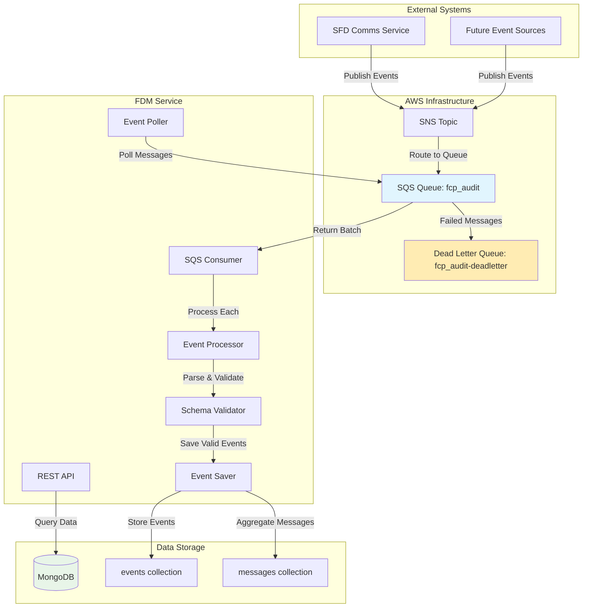
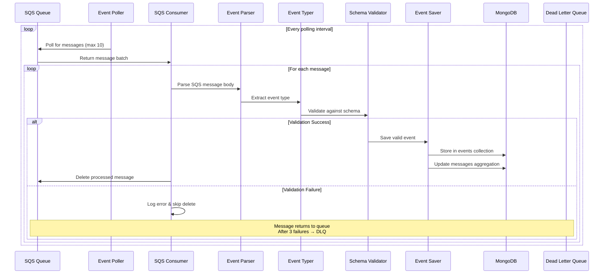

[](https://sonarcloud.io/summary/new_code?id=DEFRA_fcp-audit)
[](https://sonarcloud.io/summary/new_code?id=DEFRA_fcp-audit)
[](https://sonarcloud.io/summary/new_code?id=DEFRA_fcp-audit)
[](https://sonarcloud.io/summary/new_code?id=DEFRA_fcp-audit)
[](https://sonarcloud.io/summary/new_code?id=DEFRA_fcp-audit)

# FCP Audit service

The FCP Audit service is a common component to support auditing across the Farming and Countryside Programme (FCP) ecosystem.

FCP Audit subscribes to events across the FCP ecosystem via an AWS SQS queue. These events are persisted for later analysis and also sent to the Security Event and Incident Management (SEIM) system for security monitoring.

## Contents

- [Architecture Overview](#architecture-overview)
- [Event Processing Pipeline](#event-processing-pipeline)
  - [Processing Flow](#processing-flow)
  - [Code Layer Processing](#code-layer-processing)
- [Event Types And Scenarios](#event-types-and-scenarios)
  - [Message Events](#message-events)
- [Retry Logic And Dead Letter Queue](#retry-logic-and-dead-letter-queue)
  - [Sqs Configuration](#sqs-configuration)
  - [Localstack Setup](#localstack-setup)
  - [Mongodb Event Storage](#mongodb-event-storage)
- [Adding New Event Types](#adding-new-event-types)
  - [1. Update Event Type Mapping](#1-update-event-type-mapping)
  - [2. Create Event Schema](#2-create-event-schema)
  - [3. Create Save Handler](#3-create-save-handler)
  - [4. Naming Convention](#4-naming-convention)
  - [5. Add Test Coverage](#5-add-test-coverage)
  - [Sending Test Events](#sending-test-events)
  - [Sending Test Events In Cdp Environments](#sending-test-events-in-cdp-environments)
- [Api Endpoints](#api-endpoints)
  - [Authentication](#authentication)
    - [Setup Requirements](#setup-requirements)
    - [Authentication Flow](#authentication-flow)
- [Test Structure](#test-structure)
  - [Test Categories](#test-categories)
  - [Running Tests](#running-tests)
- [Environment Variables](#environment-variables)
  - [Core Service](#core-service)
  - [Aws](#aws)
  - [Mongodb](#mongodb)
  - [Logging](#logging)
  - [Security And Performance](#security-and-performance)
  - [Authentication](#authentication-1)
- [Using Fdm In Your Docker Compose](#using-fdm-in-your-docker-compose)
  - [Dependencies](#dependencies)
  - [Minimum Setup](#minimum-setup)
  - [Localstack Initialization Script](#localstack-initialization-script)
  - [Important Notes](#important-notes)
  - [Accessing The Service](#accessing-the-service)
- [Requirements](#requirements)
  - [Docker](#docker)
  - [Local Development](#local-development)
    - [Setup](#setup)
    - [Development](#development)
    - [Testing](#testing)
- [Licence](#licence)
  - [About The Licence](#about-the-licence)


## Architecture Overview

The FDM service follows an event-driven architecture pattern with the following key components:




## Event Processing Pipeline

The FDM service implements a robust event processing pipeline that handles CloudEvents from various sources:

> **📋 Event API Specification**  
> Complete AsyncAPI specification available at: [`docs/asyncapi.yml`](./docs/asyncapi.yml)  
> Defines all supported inbound events, schemas, and examples.

### Processing Flow



### Code Layer Processing

The event processing follows this logical flow through the codebase:

1. **Polling Layer** (`src/events/polling.js`)
   - Recursive setTimeout pattern for continuous polling
   - Configurable polling interval via `config.aws.sqs.pollingInterval`
   - Error handling with logging and retry mechanism

2. **Consumer Layer** (`src/events/consumer.js`)
   - SQS client configuration with LocalStack support
   - Batch message processing (up to 10 messages per poll)
   - Individual message processing with error isolation
   - Automatic message deletion on successful processing

3. **Processing Layer** (`src/events/process.js`)
   - Orchestrates the complete event processing pipeline
   - Calls parse → type → validate → save in sequence
   - Any failure abandons processing for that event

4. **Parser Layer** (`src/events/parse.js`)
   - Extracts CloudEvent from SQS message wrapper
   - Handles nested JSON parsing (SQS Body → SNS Message → CloudEvent)
   - Throws errors for malformed JSON structures

5. **Type Layer** (`src/events/types.js`)
   - Maps CloudEvent type to internal event category
   - Currently supports: `uk.gov.fcp.sfd.notification.*` → `message`
   - Extensible for new event type prefixes

6. **Validation Layer** (`src/events/validate.js`)
   - Dynamic schema loading based on event type
   - Uses Joi validation with CloudEvent compliance
   - Allows unknown properties for forward compatibility

7. **Save Layer** (`src/events/save.js`)
   - Dynamic import pattern: `./save/${eventType}.js`
   - Type-specific save logic for different event categories
   - Currently implements `message` event saving

## Retry Logic and Dead Letter Queue

### SQS Configuration

The service implements robust retry logic through AWS SQS configuration:

- **Visibility Timeout**: 60 seconds
- **Max Receive Count**: 3 attempts
- **Dead Letter Queue**: `fcp_audit-deadletter`
- **Redrive Policy**: Automatic after 3 failed processing attempts

### LocalStack Setup

LocalStack configuration mirrors production settings:

```bash
# Creates main queue with DLQ redrive policy
create_queue "fcp_audit"
# Automatically creates: fcp_audit-deadletter

# Configuration:
# - VisibilityTimeout: 60 seconds
# - RedrivePolicy: maxReceiveCount=3, deadLetterTargetArn=DLQ_ARN
```

### Sending Test Events

To support local development, Node.js scripts are provided for sending test events:

```bash
# List all available event scenarios
node ./scripts/send-events.js

# Send a specific scenario
node ./scripts/send-events.js streams.successful
node ./scripts/send-events.js single.messageRequest

# Available scenario types:
# - single.*: Individual event types
# - streams.*: Complete event flow scenarios
```

#### Sending Test Events in CDP Environments

Use the CDP terminal for your target environment. The AWS CLI is already installed and configured.

1. Create a test message file (SNS-wrapped CloudEvent format):
   ```bash
   cat > test-message.json << 'EOF'
   {
     "Message": "{\"specversion\":\"1.0\",\"type\":\"uk.gov.fcp.sfd.notification.message.request\",\"source\":\"sfd-comms-service\",\"id\":\"550e8400-e29b-41d4-a716-446655440000\",\"time\":\"2025-10-19T10:30:00Z\",\"datacontenttype\":\"application/json\",\"data\":{\"correlationId\":\"test-correlation-001\",\"personalisation\":{\"firstName\":\"Test\",\"lastName\":\"User\"},\"recipient\":\"test@example.com\",\"reference\":\"TEST-REF-001\",\"templateId\":\"test-template\"}}"
   }
   EOF
   ```

2. Send the message to the SQS queue:
   ```bash
   aws sqs send-message \
     --queue-url "https://sqs.eu-west-2.amazonaws.com/<account-id>/fcp_audit" \
     --message-body file://test-message.json \
     --region eu-west-2
   ```

Replace `<account-id>` with CDP environment account ID.

## Test Structure

The test suite is organized into distinct categories.

### Test Categories

1. **Unit Tests**: Fast, isolated tests with comprehensive mocking
   - Test individual functions and modules in isolation
   - Mock external dependencies (MongoDB, SQS, etc.)
   - High code coverage for business logic

2. **Integration Tests**: Test service integration points
   - Real MongoDB connections for database tests
   - Test actual save operations and data persistence
   - Verify schema compliance and data integrity

3. **Scenario Tests**: End-to-end workflow validation
   - Test complete event processing flows
   - Verify message aggregation and correlation
   - Validate business scenarios from start to finish

### Running Tests

```bash
# Run all tests with coverage
npm run docker:test

# Run tests in watch mode for development
npm run docker:test:watch
```

## Environment Variables

The FDM service can be configured using the following environment variables:

> Note: Default valid values are already applied for local development and testing through Docker Compose.

### Core Service

| Variable | Description | Default | Required |
|----------|-------------|---------|----------|
| `NODE_ENV` | Runtime environment (`development`, `test`, `production`) | - | No |
| `HOST` | IP address to bind the service | `0.0.0.0` | No |
| `PORT` | Port number to bind the service | `3004` | No |
| `SERVICE_VERSION` | Service version (injected in CDP environments) | `null` | No |
| `ENVIRONMENT` | CDP environment name | `local` | No |

### AWS

| Variable | Description | Default | Required |
|----------|-------------|---------|----------|
| `AWS_REGION` | AWS region for services | `eu-west-2` | No |
| `AWS_ENDPOINT_URL` | AWS endpoint URL (for LocalStack) | `null` | No |
| `AWS_ACCESS_KEY_ID` | AWS access key ID | `null` | No |
| `AWS_SECRET_ACCESS_KEY` | AWS secret access key | `null` | No |
| `AWS_SQS_QUEUE_URL` | SQS queue URL for event consumption | `null` | Yes |

### MongoDB

| Variable | Description | Default | Required |
|----------|-------------|---------|----------|
| `MONGO_URI` | MongoDB connection URI | `mongodb://127.0.0.1:27017/` | No |
| `MONGO_DATABASE` | MongoDB database name | `fcp-audit` | No |
| `MONGO_RETRY_WRITES` | Enable MongoDB write retries | `null` | No |
| `MONGO_READ_PREFERENCE` | MongoDB read preference | `null` | No |

### Logging

| Variable | Description | Default | Required |
|----------|-------------|---------|----------|
| `LOG_ENABLED` | Enable/disable logging | `true` (false in test) | No |
| `LOG_LEVEL` | Logging level | `info` | No |
| `LOG_FORMAT` | Log output format (`ecs`, `pino-pretty`) | `ecs` (prod), `pino-pretty` (dev) | No |

### Security and Performance

| Variable | Description | Default | Required |
|----------|-------------|---------|----------|
| `HTTP_PROXY` | HTTP proxy URL | `null` | No |
| `ENABLE_SECURE_CONTEXT` | Enable secure context | `true` (prod), `false` (dev) | No |
| `ENABLE_METRICS` | Enable metrics reporting | `true` (prod), `false` (dev) | No |
| `TRACING_HEADER` | CDP tracing header name | `x-cdp-request-id` | No |
| `DATA_GLOBAL_TTL` | Global TTL for data in seconds | `null` | No |

### Authentication

| Variable | Description | Default | Required |
|----------|-------------|---------|----------|
| `AUTH_ENABLED` | Enable authentication | `true` | No |
| `AUTH_TENANT_ID` | Microsoft Entra ID tenant ID | `null` | If Auth Enabled |
| `AUTH_ALLOWED_GROUP_IDS` | Comma-separated allowed security group IDs | `null` | If Auth Enabled |

## Using FDM in Your Docker Compose

To integrate the fcp-audit service into your own project's Docker Compose setup, you need to include the service along with its required dependencies: MongoDB and LocalStack.

### Dependencies

The fcp-audit service requires:

1. **MongoDB with replica set** - Required for MongoDB sessions to work properly
2. **LocalStack** - Provides SQS and SNS services for local development
3. **LocalStack initialization script** - Sets up the required SQS queues and SNS topics

### Minimum Setup

Add this to your `docker-compose.yml`:

```yaml
services:
  # Your existing services...
  
  fcp-audit:
    image: defradigital/fcp-audit:latest  # Or specific version tag
    depends_on:
      mongodb:
        condition: service_healthy
      localstack:
        condition: service_healthy
    environment:
      MONGO_URI: mongodb://mongodb:27017
      AWS_REGION: eu-west-2
      AWS_ACCESS_KEY_ID: test
      AWS_SECRET_ACCESS_KEY: test
      AWS_SQS_QUEUE_URL: http://localstack:4566/000000000000/fcp_audit
      AWS_ENDPOINT_URL: http://localstack:4566
    ports:
      - '3004:3004'
    networks:
      - fcp-network

  mongodb:
    image: mongo:6.0.13
    command: --replSet rs0 --bind_ip_all --port 27017
    healthcheck:
      test: test $$(mongosh --port 27017 --quiet --eval "try {rs.initiate({_id:'rs0',members:[{_id:0,host:\"mongodb:27017\"}]})} catch(e) {rs.status().ok}") -eq 1
      interval: 10s
      start_period: 10s
    ports:
      - '27017:27017'
    volumes:
      - mongodb-data:/data
    networks:
      - fcp-network

  localstack:
    image: localstack/localstack
    environment:
      LS_LOG: warn
      SERVICES: sqs,sns
      AWS_ACCESS_KEY_ID: test
      AWS_SECRET_ACCESS_KEY: test
    healthcheck:
      test: ['CMD', 'curl', 'localhost:4566']
      interval: 5s
      start_period: 5s
      retries: 3
    ports:
      - '4566:4566'
    volumes:
      - ./path/to/fcp-audit/localstack/localstack.sh:/etc/localstack/init/ready.d/localstack.sh
      - localstack-data:/var/lib/localstack
    networks:
      - fcp-network

networks:
  fcp-network:
    driver: bridge

volumes:
  mongodb-data:
  localstack-data:
```

### LocalStack Initialization Script

Copy or reference the LocalStack setup script from the fcp-audit repository at [`localstack/localstack.sh`](localstack/localstack.sh). This script creates the required SQS queues, dead letter queues, SNS topics, and subscriptions needed for the service to function properly.

### Important Notes

1. **Startup Order**: The `depends_on` conditions ensure MongoDB and LocalStack are healthy before fcp-audit starts
2. **MongoDB Replica Set**: The `--replSet rs0` command flag is essential for MongoDB sessions to work
5. **LocalStack Script**: Use the provided [`localstack/localstack.sh`](localstack/localstack.sh) script from the fcp-audit repository - it sets up all required SQS queues and SNS topics
4. **Network**: All services must be on the same Docker network to communicate
5. **Health Checks**: MongoDB and LocalStack include health checks to ensure proper startup sequencing

### Accessing the Service

Once running, the fcp-audit service will be available at:
- **API**: `http://localhost:3004`
- **Health Check**: `http://localhost:3004/health`

The service will automatically start consuming events from the SQS queue and storing them in MongoDB.

## Requirements

### Docker

This application is intended to be run in a Docker container to ensure consistency across environments.

Docker can be installed from [Docker's official website](https://docs.docker.com/get-docker/).

> The test suite includes integration tests which are dependent on a Postgres container so cannot be run without Docker.

## Local development

### Setup

Install application dependencies:

```bash
npm install
```

### Development

To run the application in `development` mode run:

```bash
npm run docker:dev
```

### Testing

To test the application run:

```bash
npm run docker:test
```

Tests can also be run in watch mode to support Test Driven Development (TDD):

```bash
npm run docker:test:watch
```

## Licence

THIS INFORMATION IS LICENSED UNDER THE CONDITIONS OF THE OPEN GOVERNMENT LICENCE found at:

<http://www.nationalarchives.gov.uk/doc/open-government-licence/version/3>

The following attribution statement MUST be cited in your products and applications when using this information.

> Contains public sector information licensed under the Open Government license v3

### About the licence

The Open Government Licence (OGL) was developed by the Controller of Her Majesty's Stationery Office (HMSO) to enable
information providers in the public sector to license the use and re-use of their information under a common open
licence.

It is designed to encourage use and re-use of information freely and flexibly, with only a few conditions.
